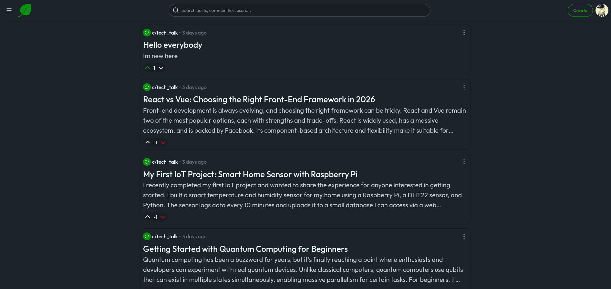
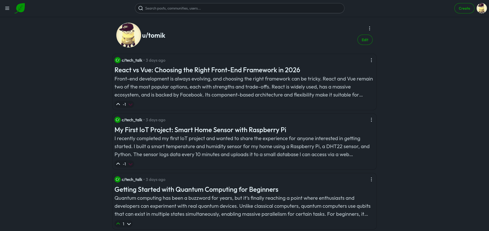
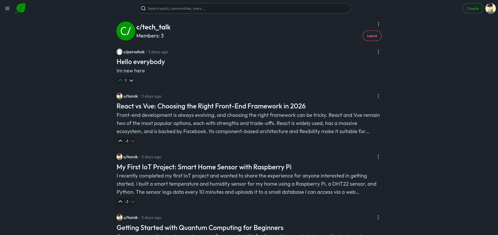
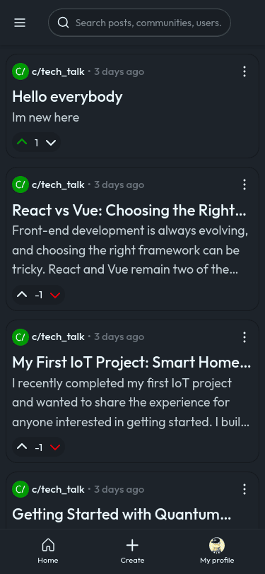

<div align="center">


**A platform for community-driven content sharing, posts, and voting.**

</div>

## 📖 Overview

Blatt is a modern web application designed for fostering online communities. It provides users with a dynamic platform to create and share posts, engage in discussions through comments, and express their opinions via upvoting and downvoting mechanisms. Built with a robust Django backend and a sleek Tailwind CSS-powered frontend, Blatt aims to deliver a fast, responsive, and engaging user experience for community interaction and content discovery.

## ✨ Features

- 🎯 **User Authentication:** Secure user registration, login, and profile management.
- 💬 **Post Creation & Management:** Create text-based posts within communities.
- ⬆️⬇️ **Upvote/Downvote System:** Express sentiment on posts with voting functionality.
- 🌐 **Community Management:** Create and join diverse communities.
- 🎨 **Responsive Design:** Modern and mobile-friendly user interface powered by Tailwind CSS.
- 🐳 **Containerized Deployment:** Easily deployable with Docker and Docker Compose.

## 🖥️ Screenshots







## 🛠️ Tech Stack

**Backend:**

[](https://www.python.org/) [](https://www.djangoproject.com/) [](https://github.com/astral-sh/uv) [](https://htmx.org/)

**Frontend:**

[](https://tailwindcss.com/) [](https://daisyui.com/)
**Database:**

[](https://www.postgresql.org/)

**DevOps & Tools:**

[](https://www.docker.com/) [](https://docs.github.com/en/actions)

## 🚀 Quick Start

Follow these steps to get Blatt up and running on your local machine using Docker Compose.

### Prerequisites

- **Docker Desktop:** Ensure Docker and Docker Compose are installed and running.
- **Node.js & npm/yarn:** Required for Tailwind CSS compilation, although primarily handled within Docker.

### Installation

1. **Clone the repository**

   ```bash
   git clone https://github.com/TurboTomik/Blatt.git
   cd Blatt
   ```

2. **Environment setup**
   Create a `.env` file from the example and configure your settings.

   ```bash
   cp .env.example .env
   ```

   Edit the newly created `.env` file with your desired values. Ensure `SECRET_KEY` is set to a strong, unique value.

3. **Build and run services with Docker Compose**
   This command will build the Docker images for Django and Tailwind, set up PostgreSQL and Redis services, run database migrations, and collect static files.

   ```bash
   docker-compose up --build
   ```

4. **Open your browser**
   Visit `http://localhost:8000` to access the application.

## 📁 Project Structure

```
Blatt/
├── .dockerignore           # Files/directories to ignore when building Docker images
├── .env.example            # Example environment variables
├── .github/                # GitHub Actions workflows
│   └── workflows/
├── .gitignore              # Git ignored files
├── .python-version         # Specifies Python version (e.g., 3.11)
├── Dockerfile.django       # Dockerfile for the Django application
├── Dockerfile.tailwind     # Dockerfile for compiling Tailwind CSS assets
├── README.md               # This README file
├── communities/            # Django app for community models, views, and templates
├── core/                   # Core Django project settings, URLs, and utilities
├── docker-compose.yml      # Defines multi-container Docker application
├── manage.py               # Django's command-line utility
├── package-lock.json       # npm lockfile for Tailwind dependencies
├── package.json            # npm package definition for Tailwind CSS
├── posts/                  # Django app for post-related models, views, and templates
├── pyproject.toml          # Python project configuration and dependencies
├── static/                 # Static assets directory (CSS output, images, JS)
├── tasks.py                # Invoke taks
├── templates/              # Base Django template files
├── users/                  # Django app for user authentication and profiles
└── uv.lock                 # Lock file for Python dependencies managed by uv
```

## ⚙️ Configuration

### Environment Variables

The application uses environment variables for sensitive data and configuration. A `.env.example` file is provided for reference. You must create a `.env` file based on it.

| Variable            | Description                                    | Default     |
| ------------------- | ---------------------------------------------- | ----------- |
| `SECRET_KEY`        | Django secret key for cryptographic signing    | `secretkey` |
| `POSTGRES_PASSWORD` | Password for the PostgreSQL database superuser | `password`  |
| `DB_NAME`           | Name of the PostgreSQL database                | `postgres`  |
| `DB_USER`           | Username for the database connection           | `postgres`  |
| `DB_PASSWORD`       | Password for the database user                 | `password`  |
| `DB_HOST`           | Hostname of the database server                | `db`        |
| `DB_PORT`           | Port number of the database server             | `5432`      |

### Configuration Files

- **`core/settings.py`**: Main Django settings file, configured to read environment variables using `django-environ` or `python-decouple`.
- **`pyproject.toml`**: Specifies Python dependencies and project metadata. Used by `uv` for dependency management.
- **`package.json`**: Specifies Node.js dependencies (Tailwind CSS, DaisyUI) and scripts for frontend asset compilation.

## 🧪 Testing

While specific test commands were not provided, a typical Django project with `pytest-django` would use:

```bash

# Run Django tests inside the web service container
docker-compose exec django uv run pytest
```

## 🤝 Contributing

We welcome contributions to Blatt! Please consider the following to get started:

### Development Setup for Contributors

1. Fork the repository.
2. Clone your forked repository: `git clone https://github.com/YOUR_USERNAME/Blatt.git`
3. Follow the [Quick Start](#🚀-quick-start) guide to set up your local development environment.
4. Make sure your changes are formatted using `ruff format` and linted with `ruff check` (these are likely defined in `pyproject.toml` or `.github/workflows`).
5. Create a new branch for your feature or bugfix: `git checkout -b feature/your-feature-name`.
6. Commit your changes following conventional commit guidelines.
7. Push your branch and open a Pull Request against the `main` branch of this repository.

## 📄 License

This project is licensed under the [MIT license](LICENSE) - see the LICENSE file for details.

## 🙏 Acknowledgments

- **Django Project**: For providing the powerful web framework.
- **Tailwind CSS**: For simplifying frontend styling.
- **DaisyUI**: For beautiful components.
- **Docker**: For enabling seamless development and deployment.
- **uv**: For efficient Python dependency management.

---

<div align="center">

Made by [TurboTomik](https://github.com/TurboTomik)
